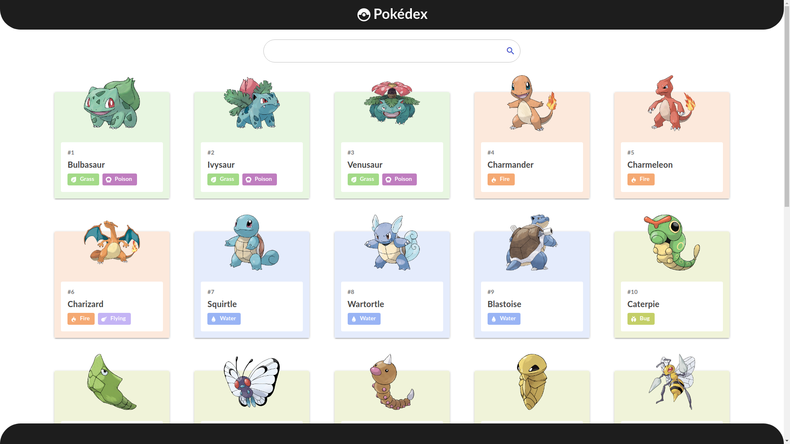

# Pokedex

<p align="center">
  
</p>

## 💻 Projeto

Desenvolver uma aplicação Web para listagem e visualização de pokémons em Vue.js. Todos os dados sobre os pokémons como nome, número, tipo, imagem, entre outras informações, foram possíveis com o uso da API REST [PokéApi](https://pokeapi.co/).

### Funcionalidades

- [x] **Listagem dos pokémons**: Listar os pokémons com o uso da API REST.

- [x] **Ampliar a listagem dos pokémons**: Método para adicionar mais pokémons a lista, ampliando o nº de pokémons mostrados ao usuário, de acordo com a rolagem do scroll.

- [x] **Buscar pokémons**: Método para filtrar os pokémons a partir do nome.

- [x] **Selecionar pokémon**: Criar uma página na aplicação com detalhes sobre o pokémon escolhido.

- [x] **Criar seções do pokémon**: Separar as informações do pokémon em duas seções: Jogos e Locais.

- [x] **Seção Jogos**: Jogos (Games) onde o Pokémon está presente.

- [x] **Seção Locais**: Áreas onde o Pokémon pode ser encontrado.

- [x] **Design Reponsivo**: Responsivo para dispositivos Mobile e Desktop.


## :rocket: Tecnologias

-  [Vue](https://vuejs.org/)
-  [Quasar](https://quasar.dev/)
-  [Axios](https://github.com/axios/axios)

## 📥 Instalação e execução

Faça um clone do repositório e acesse-o.

```bash
$ git clone https://github.com/andrecezario/pokedex.git && cd pokedex
```

```bash
# Instalando as dependências
$ npm install

# Executanto aplicação
$ quasar dev

```
